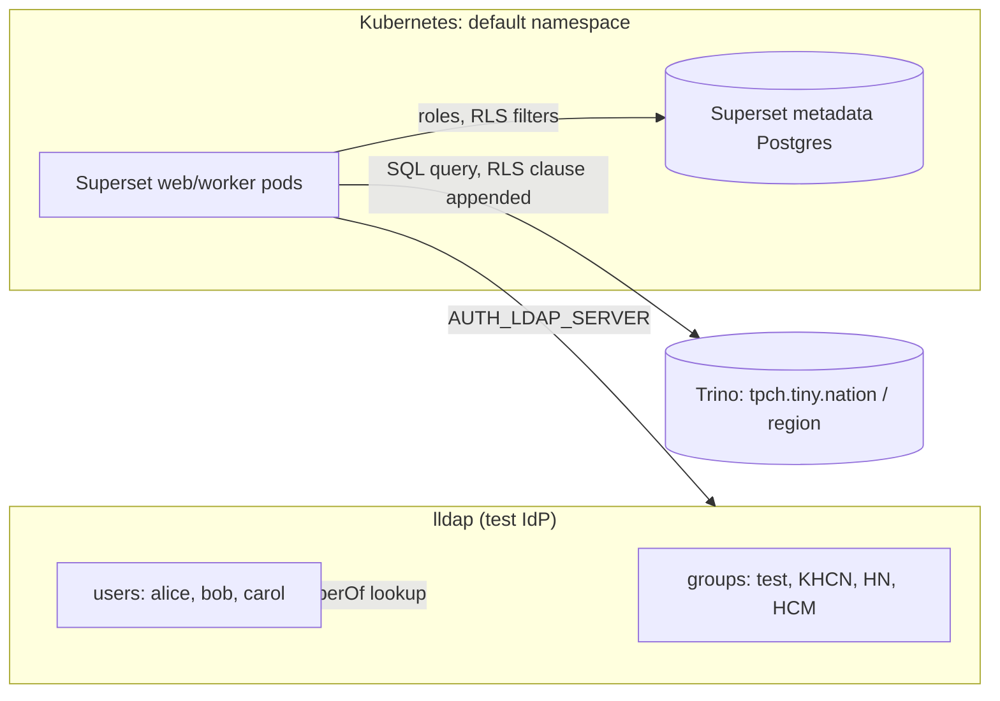

# Superset: LDAP Authentication + Row-Level Security

How to stand up Apache Superset 6.0.0 with LDAP authentication, and how to
drive Superset's Row Level Security (RLS) from attributes the LDAP server
sends at login time — specifically, LDAP group membership (`memberOf`).

This repo documents a working, verified setup: a lightweight LDAP server
(`lldap`) as the identity source, a thin custom Superset image with the LDAP
driver installed, Helm values wiring it together, and the exact steps to
create roles and RLS filters so different LDAP groups see different rows of
the same dataset.

## Architecture



The mechanism in one sentence: **LDAP `memberOf` → `AUTH_ROLES_MAPPING` →
Superset role → Row Level Security filter scoped to that role.** Nothing
about RLS is LDAP-specific; LDAP's only job is to deterministically hand a
user one or more Superset roles at login. RLS then filters by role like it
would for any other auth backend.

## Result once set up

| LDAP user | LDAP groups (`memberOf`) | Synced Superset roles | Rows visible on the demo dataset |
|---|---|---|---|
| `alice` | `cn=test` | `Admin` | all regions (unrestricted) |
| `bob` | `cn=HN`, `cn=KHCN` | `KHCN`, `Region_HN` | only `region_name = 'ASIA'` |
| `carol` | `cn=HCM`, `cn=KHCN` | `KHCN`, `Region_HCM` | only `region_name = 'EUROPE'` |

Verified with the actual Chart Data API response for `bob`:

```json
{"nation": "INDIA", "region_name": "ASIA"}
{"nation": "INDONESIA", "region_name": "ASIA"}
{"nation": "JAPAN", "region_name": "ASIA"}
{"nation": "CHINA", "region_name": "ASIA"}
{"nation": "VIETNAM", "region_name": "ASIA"}
```

---

## Part A — Stand up the test LDAP server

[lldap](https://github.com/lldap/lldap) is a minimal LDAP server good enough
for auth testing: it speaks LDAPv3, needs no schema design, and — critically
for this setup — computes a `memberOf` attribute on user entries from group
membership, which is what Superset's LDAP group-to-role mapping reads.

```bash
docker run -d --name lldap \
  --restart unless-stopped \
  -p 3890:3890 \
  -p 17170:17170 \
  -e LLDAP_JWT_SECRET="<random secret>" \
  -e LLDAP_LDAP_BASE_DN="dc=example,dc=com" \
  -e LLDAP_LDAP_USER_PASS="adminpass" \
  -v /root/lldap/data:/data \
  lldap/lldap:stable
```

- Port `3890` is the LDAP protocol port — this is what Superset connects to.
- Port `17170` is lldap's own admin web UI / REST+GraphQL API — used below to
  create users and groups, not by Superset.
- `LLDAP_LDAP_USER_PASS` sets the password for the built-in admin account,
  `uid=admin,ou=people,dc=example,dc=com`.

### Create groups and users

lldap has no LDAP-native way to create entries (no `ldapadd` support) —
everything is done through its GraphQL API. Get a JWT first:

```bash
TOKEN=$(curl -s -X POST http://localhost:17170/auth/simple/login \
  -H "Content-Type: application/json" \
  -d '{"username":"admin","password":"adminpass"}' | python3 -c "import json,sys;print(json.load(sys.stdin)['token'])")
```

Create groups (one call per group):

```bash
gql() { curl -s -X POST http://localhost:17170/api/graphql \
  -H "Authorization: Bearer $TOKEN" -H "Content-Type: application/json" -d "$1"; }

gql '{"query":"mutation{createGroup(name:\"test\"){id}}"}'
gql '{"query":"mutation{createGroup(name:\"KHCN\"){id}}"}'
gql '{"query":"mutation{createGroup(name:\"HN\"){id}}"}'
gql '{"query":"mutation{createGroup(name:\"HCM\"){id}}"}'
```

Create users:

```bash
gql '{"query":"mutation{createUser(user:{id:\"alice\",email:\"alice@example.com\",firstName:\"Alice\",lastName:\"Admin\"}){id}}"}'
gql '{"query":"mutation{createUser(user:{id:\"bob\",email:\"bob@example.com\",firstName:\"Bob\",lastName:\"KhcnHN\"}){id}}"}'
gql '{"query":"mutation{createUser(user:{id:\"carol\",email:\"carol@example.com\",firstName:\"Carol\",lastName:\"KhcnHCM\"}){id}}"}'
```

List groups to get their numeric ids (needed for the next step):

```bash
gql '{"query":"{groups{id displayName}}"}'
```

Add users to groups — `alice → test`, `bob → KHCN + HN`, `carol → KHCN +
HCM` (substitute the real group ids from the listing above):

```bash
gql '{"query":"mutation{addUserToGroup(userId:\"alice\",groupId:4){ok}}"}'
gql '{"query":"mutation{addUserToGroup(userId:\"bob\",groupId:5){ok}}"}'
gql '{"query":"mutation{addUserToGroup(userId:\"bob\",groupId:7){ok}}"}'
gql '{"query":"mutation{addUserToGroup(userId:\"carol\",groupId:5){ok}}"}'
gql '{"query":"mutation{addUserToGroup(userId:\"carol\",groupId:6){ok}}"}'
```

Set passwords — the GraphQL API has no password mutation; lldap ships a
dedicated CLI for it (present inside the container at `/app/lldap_set_password`):

```bash
for u in alice bob carol; do
  docker exec lldap /app/lldap_set_password \
    --base-url "http://localhost:17170" \
    --admin-username admin --admin-password adminpass \
    --username "$u" --password "Passw0rd!"
done
```

### Verify `memberOf` is actually returned

This is the one thing to sanity-check before touching Superset at all,
because Superset's role mapping depends entirely on it:

```bash
ldapsearch -x -H ldap://127.0.0.1:3890 \
  -D "uid=admin,ou=people,dc=example,dc=com" -w adminpass \
  -b "dc=example,dc=com" "(uid=bob)" memberOf
```

Expected:

```
dn: uid=bob,ou=people,dc=example,dc=com
memberOf: cn=HN,ou=groups,dc=example,dc=com
memberOf: cn=KHCN,ou=groups,dc=example,dc=com
```

If this doesn't show `memberOf`, nothing downstream will work — go no
further until it does.

---

## Part B — Build a Superset image with LDAP support

The published `apache/superset:6.0.0` image does **not** include
`python-ldap` (or, for that matter, `psycopg2`/`trino` — those happen to
already be present in this deployment's metadata-DB and Trino-dataset use
case, but check your own image if you need them). `python-ldap` is a C
extension with no portable prebuilt wheel, so it needs a compiler and the
OpenLDAP/SASL headers at build time.

**Do not try to install it at pod startup** (e.g. via the Helm chart's
`bootstrapScript`, which runs on every single pod start/restart). It was
tried here first and reliably lost the race against Kubernetes' startup
probe — `apt-get install build-essential` plus compiling `python-ldap` took
5–15 minutes depending on registry/mirror load, which blew past even a
generously raised `failureThreshold`, and every restart repeated the whole
compile from scratch since the container filesystem is ephemeral. Bake it
into the image once instead — see `Dockerfile.superset-ldap` in this repo:

```dockerfile
FROM apache/superset:6.0.0
USER root
RUN apt-get update -qq \
    && apt-get install -y --no-install-recommends libldap2-dev libsasl2-dev build-essential python3-dev \
    && /app/.venv/bin/python -m ensurepip --upgrade \
    && /app/.venv/bin/python -m pip install --no-cache-dir python-ldap trino psycopg2-binary \
    && apt-get purge -y --auto-remove build-essential python3-dev \
    && rm -rf /var/lib/apt/lists/*
USER superset
```

Two non-obvious details baked into that Dockerfile:

- **Use the app's venv pip, not the system `pip`.** The base image's Python
  environment is a virtualenv at `/app/.venv`, and it's on `PATH` ahead of
  the system Python — but a bare `pip install` on this image resolves to
  `/usr/local/bin/pip` (pulled in by the `python3-dev` apt package), which
  installs into the *system* site-packages, invisible to the app. Always
  install with `/app/.venv/bin/python -m pip install ...`.
- **`ensurepip` first.** This image's venv was built with `uv`, which
  doesn't bundle `pip` by default — `/app/.venv/bin/python -m pip` fails
  with `No module named pip` until you run `ensurepip`.

Build and get it into the cluster:

```bash
docker build -f Dockerfile.superset-ldap -t superset-ldap:6.0.0 .

# Verify before deploying anything:
docker run --rm superset-ldap:6.0.0 python3 -c "import ldap, psycopg2, trino; print('OK')"
docker run --rm -e SUPERSET_SECRET_KEY=x superset-ldap:6.0.0 superset version
```

If your kubelet pulls from a registry your cluster can reach, push it there
and point the Helm chart's `image.repository`/`image.tag` at it — the
normal path. If you're on a single-node cluster where the image only needs
to exist on that one node's containerd (as here, on RKE2/k3s), import it
directly into containerd's `k8s.io` namespace instead of pushing anywhere:

```bash
docker save docker.io/library/superset-ldap:6.0.0 -o superset-ldap-6.0.0.tar

ctr -a /run/k3s/containerd/containerd.sock -n k8s.io images import \
  --platform linux/amd64 superset-ldap-6.0.0.tar

# Required: containerd's CRI plugin only "sees" images carrying this label —
# `ctr images import` alone does not set it, so `crictl images` (and hence
# kubelet's ImageStatus check, and hence `imagePullPolicy: IfNotPresent`)
# won't find the image without this.
ctr -a /run/k3s/containerd/containerd.sock -n k8s.io images label \
  docker.io/library/superset-ldap:6.0.0 io.cri-containerd.image=managed
```

Watch out for kubelet's image garbage collector: if the node is under disk
pressure and no running pod references the image yet, kubelet can reclaim it
between the import and the first pod actually starting. If a freshly
imported image disappears from `crictl images` before its pod comes up,
re-import and immediately restart the pod (`kubectl delete pod ...`) so it
gets pinned as "in use" before the next GC pass.

---

## Part C — Configure Superset for LDAP auth

Everything below lives in `configOverrides` in the Helm values (see
`superset-values.yaml` in this repo for the full file) — the chart pastes
each entry verbatim into `superset_config.py`.

```python
from flask_appbuilder.security.manager import AUTH_LDAP

AUTH_TYPE = AUTH_LDAP
AUTH_USER_REGISTRATION = True
AUTH_USER_REGISTRATION_ROLE = "Gamma"   # fallback role if no group mapping matches

AUTH_LDAP_SERVER = "ldap://<ldap-host>:3890"
AUTH_LDAP_SEARCH = "dc=example,dc=com"
AUTH_LDAP_UID_FIELD = "uid"

AUTH_LDAP_BIND_USER = "uid=admin,ou=people,dc=example,dc=com"
AUTH_LDAP_BIND_PASSWORD = "adminpass"

AUTH_LDAP_FIRSTNAME_FIELD = "givenName"
AUTH_LDAP_LASTNAME_FIELD = "sn"
AUTH_LDAP_EMAIL_FIELD = "mail"

# The "additional attribute sent with login info from LDAP" that drives RLS:
# memberOf is read on every login and mapped to Superset roles below.
AUTH_LDAP_GROUP_FIELD = "memberOf"
AUTH_ROLES_SYNC_AT_LOGIN = True

AUTH_ROLES_MAPPING = {
    "cn=test,ou=groups,dc=example,dc=com": ["Admin"],

    # The LDAP bind account's own group must be mapped too -- see the
    # gotcha below. Without this line the bind account loses Admin on
    # its very next login.
    "cn=lldap_admin,ou=groups,dc=example,dc=com": ["Admin"],

    "cn=KHCN,ou=groups,dc=example,dc=com": ["KHCN"],
    "cn=HN,ou=groups,dc=example,dc=com": ["KHCN", "Region_HN"],
    "cn=HCM,ou=groups,dc=example,dc=com": ["KHCN", "Region_HCM"],
}
```

### Gotcha: `AUTH_ROLES_SYNC_AT_LOGIN` recalculates roles from scratch on
### every login — including for accounts you didn't mean to touch

`AUTH_ROLES_SYNC_AT_LOGIN = True` means the user's Superset role set is
**replaced**, not merged, on every login, with whatever
`AUTH_ROLES_MAPPING` computes from their current `memberOf` value (falling
back to `AUTH_USER_REGISTRATION_ROLE` if nothing matches). This bit us
directly: the LDAP bind account (`uid=admin`) is a member of lldap's own
built-in `lldap_admin` group, which wasn't in `AUTH_ROLES_MAPPING`. The
first time that account logged into Superset through LDAP (which happens
any time you authenticate as `admin` via the LDAP provider — including just
to test the setup), its pre-existing `Admin` role was silently stripped
down to only the default `Gamma` fallback.

**Fix**: map every LDAP group that any account you care about actually
belongs to, including infrastructure/bind accounts — as shown above with
`cn=lldap_admin`. If you hit this after the fact, the role has to be
restored directly:

```sql
insert into ab_user_role (id, user_id, role_id)
select coalesce(max(id),0)+1, <user_id>, <admin_role_id>
from ab_user_role;
```

(Watch the sequence when doing this by hand — see Troubleshooting below.)

### Also required: `python-ldap`/`trino`/`psycopg2` need libc/OS packages

Already covered by the image in Part B — noted here only so the config and
the image requirement stay linked in your head: `AUTH_TYPE = AUTH_LDAP`
does nothing useful without `python-ldap` importable in the running
container, and there's no in-app error that says so clearly — it surfaces
as `ModuleNotFoundError: No module named 'ldap'` or `'psycopg2'` deep in a
gunicorn worker traceback at startup.

---

## Part D — Deploy

```bash
helm upgrade --install superset superset/superset \
  -f superset-values.yaml -n default
```

Key values to set alongside the LDAP `configOverrides` above (see the full
file in this repo):

```yaml
image:
  repository: docker.io/library/superset-ldap   # the image from Part B
  tag: "6.0.0"
  pullPolicy: IfNotPresent

extraSecretEnv:
  SUPERSET_SECRET_KEY: "<random secret>"         # Superset refuses to start on the default
```

If you're changing an **existing** release's chart version, be aware that a
newer chart can change the Deployment's `spec.selector.matchLabels` (this
happened going from an old pinned `superset-0.15.5` install to whatever the
repo currently serves) — that field is immutable on a Kubernetes
Deployment, so `helm upgrade` fails outright with a `field is immutable`
error. The fix is `helm uninstall` + fresh `helm install`, not an upgrade.
This is safe for the Postgres metadata store specifically because
StatefulSet-managed PVCs (`data-superset-postgresql-0`, created from the
chart's `volumeClaimTemplate`) are **not** deleted by `helm uninstall` —
only by deleting the PVC object directly, which uninstall doesn't do. A
fresh install with the same release name and same `postgresql.auth`
credentials reattaches to the existing PVC and keeps every user, role, and
dataset that was already there.

---

## Part E — Create the roles `AUTH_ROLES_MAPPING` refers to

**Flask-AppBuilder does not auto-create roles named in `AUTH_ROLES_MAPPING`.**
If a mapped role name (`KHCN`, `Region_HN`, `Region_HCM` here) doesn't
already exist, FAB logs a warning and silently drops it from the user's
role set for that login:

```
WARNING:flask_appbuilder.security.manager:Can't find role specified in AUTH_ROLES_MAPPING: KHCN
```

Create them once, as an admin, before anyone in those LDAP groups logs in
for real (or just re-log them in afterward — `AUTH_ROLES_SYNC_AT_LOGIN`
recalculates every time):

```bash
# Log in as the LDAP bind account, which now maps to Superset's Admin role
# (see the cn=lldap_admin mapping above)
TOKEN=$(curl -s -X POST http://localhost:8088/api/v1/security/login \
  -H "Content-Type: application/json" \
  -d '{"username":"admin","password":"adminpass","provider":"ldap","refresh":true}' \
  | python3 -c "import json,sys;print(json.load(sys.stdin)['access_token'])")

# Superset's API CSRF check needs a session cookie paired with the CSRF
# token, not just the header -- use a cookie jar across both calls.
COOKIES=cookies.txt
CSRF=$(curl -s -c $COOKIES -b $COOKIES http://localhost:8088/api/v1/security/csrf_token/ \
  -H "Authorization: Bearer $TOKEN" | python3 -c "import json,sys;print(json.load(sys.stdin)['result'])")

for role in KHCN Region_HN Region_HCM; do
  curl -s -c $COOKIES -b $COOKIES -X POST http://localhost:8088/api/v1/security/roles/ \
    -H "Authorization: Bearer $TOKEN" -H "X-CSRFToken: $CSRF" \
    -H "Content-Type: application/json" -H "Referer: http://localhost:8088/" \
    -d "{\"name\":\"$role\"}"
done
```

A brand-new role starts with **zero permissions** — it can't see any
dataset yet, RLS or not. Grant it access to the datasource(s) it needs
(`Admin` UI: *Settings → List Roles → edit role → add
"datasource access on [DB].[table]"* and "database access on [DB]"; or via
SQL against `ab_permission_view` / `ab_permission_view_role` if scripting
this, matching the pattern in Part F below). Skipping this step produces a
clear, specific error rather than silently-wrong data —
`DATASOURCE_SECURITY_ACCESS_ERROR`, "This endpoint requires the datasource
..., database or `all_datasource_access` permission" — which is the signal
to go grant it.

---

## Part F — Set up the actual Row Level Security

RLS in Superset is a straightforward mechanism once the LDAP → role
plumbing above is in place: a filter is a SQL clause, scoped to one or more
datasets, that applies **only to users holding one of the roles it's
scoped to**. Everyone else queries the dataset unfiltered (or filtered by
whichever *other* RLS rule matches their own roles).

### Demo dataset

A virtual (SQL-defined) dataset over Trino's built-in `tpch` sample data —
chosen because it's read-only, always available, and needs no data loading:

```sql
SELECT n.name AS nation, r.name AS region_name
FROM tpch.tiny.nation n
JOIN tpch.tiny.region r ON n.regionkey = r.regionkey
```

Create it via the API (or Superset's UI: *Data → Datasets → + Dataset →
SQL*):

```bash
curl -s -c $COOKIES -b $COOKIES -X POST http://localhost:8088/api/v1/dataset/ \
  -H "Authorization: Bearer $TOKEN" -H "X-CSRFToken: $CSRF" \
  -H "Content-Type: application/json" -H "Referer: http://localhost:8088/" \
  -d '{
    "database": 1,
    "table_name": "rls_demo_nation_region",
    "sql": "SELECT n.name AS nation, r.name AS region_name FROM tpch.tiny.nation n JOIN tpch.tiny.region r ON n.regionkey = r.regionkey"
  }'
```

### RLS filters

Two filters, each scoped to one of the roles the LDAP groups map to:

```bash
curl -s -c $COOKIES -b $COOKIES -X POST http://localhost:8088/api/v1/rowlevelsecurity/ \
  -H "Authorization: Bearer $TOKEN" -H "X-CSRFToken: $CSRF" \
  -H "Content-Type: application/json" -H "Referer: http://localhost:8088/" \
  -d '{
    "name": "RLS - HN region only",
    "filter_type": "Regular",
    "tables": [1],
    "roles": [<Region_HN role id>],
    "group_key": "region",
    "clause": "region_name = '\''ASIA'\''"
  }'

curl -s -c $COOKIES -b $COOKIES -X POST http://localhost:8088/api/v1/rowlevelsecurity/ \
  -H "Authorization: Bearer $TOKEN" -H "X-CSRFToken: $CSRF" \
  -H "Content-Type: application/json" -H "Referer: http://localhost:8088/" \
  -d '{
    "name": "RLS - HCM region only",
    "filter_type": "Regular",
    "tables": [1],
    "roles": [<Region_HCM role id>],
    "group_key": "region",
    "clause": "region_name = '\''EUROPE'\''"
  }'
```

`filter_type: "Regular"` ANDs the clause onto every query against the
dataset for a matching user. (`"Base"` behaves similarly but with
different combination semantics when multiple filters apply to the same
user — see Superset's own RLS docs if you need to stack rules.) The
`clause` field is a raw SQL boolean expression injected into the `WHERE` —
it can reference `current_username()`, `current_user_id()`, and other Jinja
helpers Superset exposes if you want the filter itself to vary per-user
rather than per-role (not needed here, since the role already encodes
which region a user belongs to).

That's the whole RLS setup. The LDAP group is doing all the interesting
work upstream of this — by the time a request reaches the RLS layer, it's
indistinguishable from RLS configured against a DB-auth or OAuth user with
the same role.

---

## Part G — Test it end-to-end

Log each user in through LDAP and query the dataset via the Chart Data API
(this exercises the same code path a real chart/dashboard would):

```bash
login() {
  curl -s -X POST http://localhost:8088/api/v1/security/login \
    -H "Content-Type: application/json" \
    -d "{\"username\":\"$1\",\"password\":\"$2\",\"provider\":\"ldap\",\"refresh\":true}" \
    | python3 -c "import json,sys;print(json.load(sys.stdin)['access_token'])"
}

query_as() {
  local user=$1 pass=$2 cookies=cookies_$1.txt tok csrf
  tok=$(login "$user" "$pass")
  csrf=$(curl -s -c "$cookies" -b "$cookies" http://localhost:8088/api/v1/security/csrf_token/ \
    -H "Authorization: Bearer $tok" | python3 -c "import json,sys;print(json.load(sys.stdin)['result'])")
  curl -s -c "$cookies" -b "$cookies" -X POST http://localhost:8088/api/v1/chart/data \
    -H "Authorization: Bearer $tok" -H "X-CSRFToken: $csrf" \
    -H "Content-Type: application/json" -H "Referer: http://localhost:8088/" \
    -d '{"datasource":{"id":1,"type":"table"},"queries":[{"columns":["region_name"],"row_limit":1000,"metrics":[],"orderby":[]}],"result_format":"json","result_type":"full"}'
}

query_as alice "Passw0rd!"   # -> ASIA, AMERICA, AFRICA, EUROPE, MIDDLE EAST (Admin: unrestricted)
query_as bob   "Passw0rd!"   # -> ASIA only
query_as carol "Passw0rd!"   # -> EUROPE only
```

Also worth confirming directly against the metadata DB, since it shows the
LDAP → role sync independent of RLS:

```sql
select u.username, r.name
from ab_user u
join ab_user_role ur on u.id = ur.user_id
join ab_role r on r.id = ur.role_id
order by u.username, r.name;
```

Expected after all three have logged in once:

```
 admin | Admin
 admin | Gamma
 alice | Admin
 alice | Gamma
 bob   | Gamma
 bob   | KHCN
 bob   | Region_HN
 carol | Gamma
 carol | KHCN
 carol | Region_HCM
```

---

## Troubleshooting

**`ModuleNotFoundError: No module named 'ldap'` at Superset startup** — the
image doesn't have `python-ldap` installed into the venv Superset actually
runs under. See Part B; check with
`docker run --rm <image> python3 -c "import ldap"` before deploying.

**Pod stuck restarting during a heavy `bootstrapScript`, startup probe
failing with `connection refused`** — the probe is timing out before a
runtime `apt-get install` + compile finishes, and every restart repeats it
from zero. Don't install compiled dependencies at pod startup; bake them
into the image (Part B).

**`Can't find role specified in AUTH_ROLES_MAPPING: <name>`** in the logs —
the role doesn't exist yet in Superset's RBAC. Create it (Part E); FAB does
not auto-create mapped roles.

**A previously-Admin account gets silently downgraded to `Gamma` after
logging in via LDAP once** — `AUTH_ROLES_SYNC_AT_LOGIN` replaced its role
set because none of its LDAP groups were in `AUTH_ROLES_MAPPING`. Map every
group any real account belongs to, not just the "interesting" ones — see
the `cn=lldap_admin` gotcha in Part C.

**`DATASOURCE_SECURITY_ACCESS_ERROR` when a user with the "right" RLS role
still can't query the dataset** — RLS restricts *rows*, it doesn't grant
*access*. The role also needs `datasource_access` (and `database_access`)
permission-views attached, same as any other Superset role. Grant this
through the role editor UI, or by inserting into
`ab_permission_view_role` (see below) if scripting it.

**`duplicate key value violates unique constraint "..._pkey"` on a table
you just inserted into by hand** — if you ever insert into a FAB-managed
table (`ab_user_role`, `ab_permission_view_role`, etc.) with a manually
computed `id` (e.g. `max(id)+1`) instead of the table's sequence, the
sequence itself doesn't advance, and the next row the *application* inserts
via `nextval()` collides with the id you already used. Always insert with
`nextval('<table>_id_seq')` explicitly, never a hand-computed id:

```sql
insert into ab_permission_view_role (id, permission_view_id, role_id)
values (nextval('ab_permission_view_role_id_seq'), <perm_view_id>, <role_id>);
```

If you've already caused a collision, resync the sequence to the table's
actual max before the app tries to insert again:

```sql
select setval('ab_permission_view_role_id_seq', (select max(id) from ab_permission_view_role));
```

**`{"message":{"provider":["Alternative authentication provider is not
allowed"]}}`** on `/api/v1/security/login` — you passed `"provider":"db"`
while `AUTH_TYPE = AUTH_LDAP` is set globally; the app only accepts
`"provider":"ldap"` (or omit `provider`) once LDAP is the configured auth
type. Any pre-existing local Superset user can still be reached this way if
their **username** matches an LDAP entry — logging in as `admin`/LDAP
authenticates against the LDAP directory, then reuses/updates Superset's
existing local `admin` row by username.

**A POST to `/api/v1/security/roles/` or `/api/v1/dataset/` returns `"The
CSRF session token is missing"` even with a valid `X-CSRFToken` header** —
fetch the CSRF token and make the follow-up request through the *same
cookie jar* (`curl -c cookies.txt -b cookies.txt ...` for both calls). The
CSRF token is paired with a session cookie set by the
`/api/v1/security/csrf_token/` call; sending only the JWT and the header
without that cookie fails validation on some endpoints.

**Kubelet reports `DiskPressure` and evicts pods (including, confusingly,
unrelated ones like `postgresql`/`redis`) while building a large custom
image on the same node** — image builds and `docker save`/`ctr import`
tarballs can transiently consume tens of GB. If the node crosses kubelet's
`imagefs`/`nodefs` high-watermark (commonly ~85%), it starts garbage
collecting *and* evicting, and can reclaim images you just imported before
any pod uses them (see Part B). Prune build cache (`docker builder prune
-af`) between builds, and clean up stale `Evicted`/`ContainerStatusUnknown`
pods across the cluster (`kubectl delete pods --field-selector
status.phase=Failed`) to let kubelet reclaim their leftover container
state — this is often enough to bring usage back under the threshold
without touching other projects' images.
